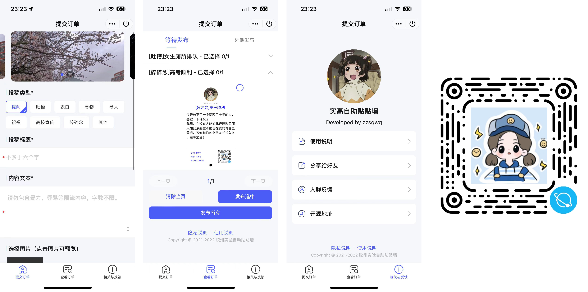

# Postwall-MiniApp-uni

Uni-app 版本的小程序发单工具，可扫描右侧二维码体验

使用 [FirstUI](https://github.com/FirstUI/FirstUI)，后端使用 Java [Spring Boot](https://spring.io)，暂未开源

## 功能 List

- [x] 投稿订单

- [x] 删除订单/发布订单/拒绝订单

- [x] 订单翻页

- [x] 发布当页/删除当页

- [x] 使用说明

- [x] 轮转图展示

- [ ] 自定义拒发信息 

## Lincense 

GPL v3.0
